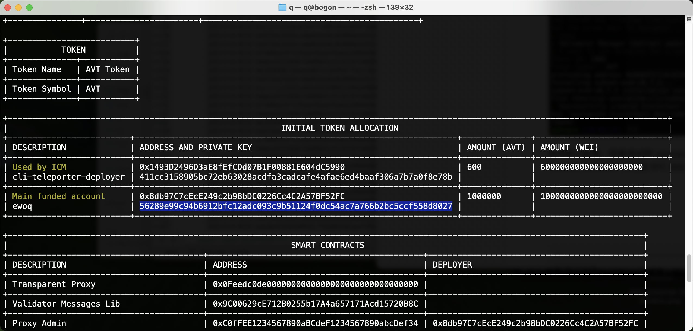

本作业的主要工作如下：

1. 参考官方文档在本地成功部署了 Avalanche L1 网络，名为 AVTestnet。
2. 使用 Solidity 编写了一个 ERC721 标准的 NFT 合约，名为 Happy Dog Club。
3. 通过 Remix IDE 将该合约部署在 AVTestnet，并执行了铸造和转账操作。

[TOC]

## 本地部署

参考 [官方文档](https://build.avax.network/docs/tooling/create-deploy-avalanche-l1s/deploy-locally)

安装 Avalanche-CLI:

```bash
curl -sSfL https://raw.githubusercontent.com/ava-labs/avalanche-cli/main/scripts/install.sh | sh -s
# 可执行文件安装在 ~/bin 目录, 将其添加到 PATH
echo 'export PATH=~/bin:$PATH' >> ~/.zshrc
```

使用默认配置，创建测试网 `avalanche blockchain create AVTestnet`, 其中 Chain ID 为 1903，代币符号为 **AVT**。


使用默认配置，部署测试网 `avalanche blockchain deploy AVTestnet`，通过初始代币分配信息得到 Main Funded Account，并得到 RPC 地址。




使用 Metamask 连接该网络，并登录 Main Funded Account，查看 AVT 余额，说明网络部署成功。


## NFT 合约编写

关于 ERC-721 的标准，参考 https://eips.ethereum.org/EIPS/eip-721

每个符合 ERC-721 的合约都必须实现 `ERC721` 和 `ERC165` 接口。

我的目标是实现一个 ERC-721 标准合约，至少支持 Mint 和 Transfer 操作。

NFT 名称为 Happy Dog Club，符号为 DOG，总发行量为 5 个。

***

在 OpenZeppelin 库中已经有基本的 ERC721 实现，我们继承该合约，增加一些自定义逻辑：

+ 增加一个 `MintDog` 函数用于接受 Wei 并**铸造 NFT**

+ 使用 ERC-721 的 Metadata 扩展，为**每个 NFT 分配一个 URI**，以在钱包中显示 NFT 图片

  URI 指明一个 JSON 地址，JSON 包含标准规定的 name, description, image 三个字段，具体如下

  ```json
  {
    "name": "Test Dog #0",
    "description": "A local test NFT on Subnet-EVM",
    "image": "http://localhost:8000/images/0.jpg"		# 后续考虑改成 IPFS 地址
  }
  ```

完整 Solidity 代码如下：

```solidity
// SPDX-License-Identifier: MIT
pragma solidity ^0.8.24;

import "@openzeppelin/contracts/token/ERC721/extensions/ERC721URIStorage.sol";
import "@openzeppelin/contracts/access/Ownable.sol";
import "@openzeppelin/contracts/utils/Counters.sol";
import "@openzeppelin/contracts/utils/Strings.sol";

contract Dog_NFT is ERC721URIStorage, Ownable
{
    uint8 public total_supply = 0;
    uint8 public constant MAX_NFT_Supply = 5;		// 总发行量
    uint256 public constant NFT_Price = 100;		// 每张 NFT 的价格

    constructor(string memory name_, string memory symbol_) ERC721(name_, symbol_) Ownable(msg.sender) {}


    // 铸造 Dog NFT
    function mintDog(uint8 numberOfTokens) public payable 
    {
        require(total_supply + numberOfTokens <= MAX_NFT_Supply, "Purchase would exceed max supply of Dogs");
        require(NFT_Price * numberOfTokens <= msg.value);
        
        for (uint i = 0; i < numberOfTokens; i++)
        {
        		// 借助 openzeppelin 开源实现
            _safeMint(msg.sender, total_supply++);	
        }
    }

    // NFT URI
    function _baseURI() internal pure override returns (string memory) 
    {
        return "http://localhost:8000/metadata/";
    }
    
    // 返回一个 JSON 文件地址
    function tokenURI(uint256 tokenId) public view override returns (string memory)
    {
        _requireOwned(tokenId);
        string memory baseURI = _baseURI();
        return bytes(baseURI).length > 0 ? string.concat(baseURI, Strings.toString(tokenId), ".json") : "";
    }

}
```

## NFT 合约测试

由于我们的 Avalanche L1 链部署在 Subnet-EVM 上，因此我们可以直接用 Remix IDE 来部署并测试合约。

在测试之前，先用 python 部署一个本地服务，用于访问 JSON 和图片文件，在工作目录使用 `python -m http.server 8000` 即可。

### 部署合约

首先，使用 Genesis 地址，部署该合约，部署时需要用 Metamask 对交易进行签名。


### 铸造 NFT

使用 Genesis 账户铸造两个 NFT，仍然需要 Metamask 签名，并附带一些 Wei 转账。


在 Metamask 中查看 NFT 铸造结果，符合预期。


.              >                  


使用另一个我的个人账户，连接到测试网，先用 Genesis 给我的账户发送一些余额，然后也铸造两个 NFT，用于接下来的转账。


### NFT 转账

转账有两种等价的方式，一种是直接用 Remix IDE 调用 `safeTransferFrom` 方法，一种是直接在 Metamask 上操作。

我们把两个账户互相转一个 NFT，使用两种方式。

***

使用 Remix IDE 从 Genesis 转出编号为 0 的 NFT：


***

同理，从另一个账户使用 Metamask 转出一个 NFT：


***

最终结果符合预期:

         

***

后续: 可以把存储放到 IPFS 上。
